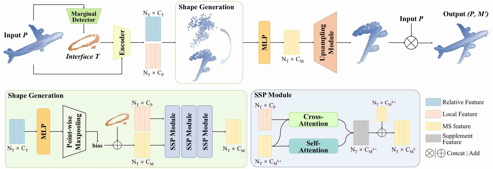

# SPAC-Net: Rethinking Point Cloud Completion with Structural Prior


This repository contains PyTorch implementation for SPAC-Net: Rethinking Point Cloud Completion with Structural Prior.

SPAC-Net aims to rethink the completion task under the guidance of a novel structural prior. Specifically, our method first leverages Marginal Detector (MAD) module to localize the interface, which is defined as the intersection between the known observation and the missing parts, as the structural prior in our work. Based on the interface, our method then predicts the coarse shape by learning the displacement that points in interface move to their corresponding position in missing parts. Furthermore, we introduce an additional Structure Supplement (SSP) module before shape upsampling stages to dynamically update the structural details of the coarse shape while enable the upsampling module to prioritize its own upsampling ability.



## News
- **2024-11-26** We release the model's network architecture and some of its inference code; we will update the remaining parts gradually in the next month.

## Usage

### Anaconda
#### Create base environment
```
conda create -n spac-net python==3.9
conda activate spac-net
```

### Requirements
```
pip install -r requirements.txt
```

### Install PointNet++
```
pip install "git+git://github.com/erikwijmans/Pointnet2_PyTorch.git#egg=pointnet2_ops&subdirectory=pointnet2_ops_lib"
```

### Install Chamfer Distance and KNN_CUDA
```
sh install.sh
```

## Acknowledgements

Our code is based on [PoinTr](https://github.com/yuxumin/PoinTr).

